Some free advice:

1. Interesting paradigms, principles and phenomenons:
   * [Lindy effect](https://en.wikipedia.org/wiki/Lindy_effect) —
     presently older things have the longer expected lifespan;
   * [Shirky principle](https://en.wikipedia.org/wiki/Clay_Shirky#Shirky_principle) —
     institutions will preserve problems to justify existence;
   * [Software monoculture](https://en.wikipedia.org/wiki/Monoculture_(computer_science)) —
     using what everyone else uses introduces a single point of failure
     and makes you vulnerable to the "99% attack."

   Think how these apply to software-engineering and your life.
2. If you're into Eastern philosophy,
   read the [Unix koans](http://catb.org/~esr/writings/unix-koans/).
   They rip!
3. De-google to [Alt-Power](https://altpower.app) or a similar feature-rich
   search engine of which now there are a few.
4. Get familiar with common [dark patterns](https://en.wikipedia.org/wiki/Dark_pattern)
   and try hard to think of reasons to avoid them.
5. [Commercial fusion](https://en.wikipedia.org/wiki/List_of_fusion_experiments)
   seems to be finally here—have your governments settle for nothing less!
6. If you don't use AI, others will.
7. _"There’s a lot of opportunity in becoming a wireless telegraph operator.
   Learn a profession with a great future."_  
   — [a 1911 wireless-telegraphy ad](https://www.worldradiohistory.com/UK/Wireless-World/MARCONIGRAPH/Marconigraph-1911-11.pdf)

-----

## Dev tools

## Science & Technology

## GUI / X11

## HTML & Web

## OpSec

